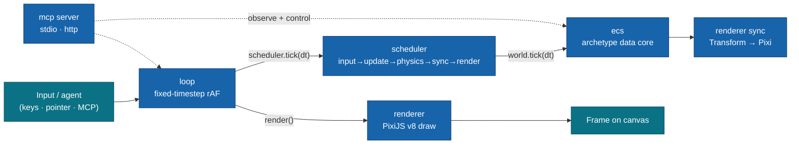

# game

**An ECS game framework for Moku — Spark-style API and memory layout, PixiJS v8 rendering, with the live runtime exposed to agents over MCP.**

`game` is a typed Entity-Component-System runtime you compose into a Moku app: archetype object-SoA component storage, a fixed-timestep loop that bypasses the kernel for the hot path, and eight plugins that wire ECS, scheduling, rendering, input, assets, scenes, and an MCP server together. It is **not** a game engine UI or a level editor — there is no scene graph GUI, no asset pipeline, no runtime of its own beyond `@moku-labs/core`. You define components and systems in TypeScript and drive frames; the framework owns the data layout, the stage order, and the GPU lifecycle.

<br/>

[](#requirements)
[](#requirements)
[](#requirements)
[](./LICENSE)

<br/>

[Why game](#why-game) · [Quick start](#quick-start) · [How it works](#how-it-works) · [Core concepts](#core-concepts) · [Plugins](#plugins) · [Events](#events) · [Scripts](#scripts) · [Requirements](#requirements) · [Docs](#docs) · [License](#license)

---

## Why game

- **Archetype, object-SoA storage.** Entities that share a component signature live in one archetype with parallel columns, so queries iterate cache-coherently — not a `Map<id, object>` scan per frame. A per-component storage seam lets high-churn tags opt into `"sparse"` storage instead.
- **A runtime, not an engine.** No editor, no scene-graph GUI, no built-in asset pipeline — you compose plugins into your own Moku app via `createApp` and write systems in TypeScript. Define by negation: it owns the data model and the frame, you own the game.
- **The hot path bypasses the kernel.** The fixed-timestep loop drives `scheduler.tick(dt)` → `world.tick(dt)` → `renderer.render()` directly, with no event-bus round-trip per frame. Per-frame work is deliberately *not* emitted as kernel events.
- **Spark-style public API.** `defineComponent`, callable component tokens, typed variadic queries (arities 1–8), a deferred command buffer, and `world.tick(dt)` — the API and memory layout are modeled on [AlexTiTanium/spark](https://github.com/AlexTiTanium/spark).
- **First-class MCP.** A Model Context Protocol server exposes the live runtime to agent clients (stdio and/or Streamable HTTP) — query state, step the loop, spawn entities, load scenes, screenshot the frame — without touching game code.
- **Composable with the Moku family.** Built on `@moku-labs/core`, logs and reads env via `@moku-labs/common`, and mounts its Pixi canvas into a DOM surface from `@moku-labs/web`.

## Quick start

```sh
bun add game @moku-labs/core @moku-labs/common pixi.js
```

> [!NOTE]
> **Status: `0.x` — early.** Pre-1.0; the public surface may still shift. `game` is unpublished (version `0.0.0`) — install from the repository. Consumers use `createApp` from the framework and never import `@moku-labs/core` directly.

```ts
import { createApp } from "game";
import { Container } from "pixi.js";

// 1. Create the app (synchronous); start() is async and boots the Pixi Application.
const app = createApp({
  pluginConfigs: {
    renderer: { width: 1280, height: 720, background: 0x1099bb, mount: "#game" },
    loop: { fixedDt: 1 / 60 }
  }
});

await app.start();

// 2. Define components on the ECS world (app.ecs IS the World facade).
const Velocity = app.ecs.defineComponent(() => ({ dx: 0, dy: 0 }));

// 3. Define a scene — entities spawned here are owned by the scene.
app.scene.define("level1", {
  setup: (world) => {
    const player = world.spawn(
      app.renderer.Transform({ x: 100, y: 100, rotation: 0, scaleX: 1, scaleY: 1 }),
      Velocity({ dx: 60, dy: 0 })
    );
    app.renderer.attach(player, new Container());
  }
});

// 4. A movement system runs every "update" stage; input is polled, not subscribed.
app.scheduler.addSystem("update", (world, dt) => {
  const input = app.input.snapshot();
  world.query(app.renderer.Transform, Velocity).updateEach(([t, v]) => {
    if (input.isDown("ArrowRight")) t.x += v.dx * dt;
  });
});

await app.scene.load("level1"); // the loop is already driving frames (autoStart: true)
```

## How it works

The `loop` plugin owns the frame. Each fixed step it drives the `scheduler`, which runs every system in canonical stage order against the single ECS `world`; the `renderer` draws once per frame. `mcp` reaches into the same runtime so agents can observe and control it.



## Core concepts

- **The ECS is the data core.** `app.ecs` returns the `World` facade directly — no wrapper. `defineComponent(create, opts?)` registers a component (callable token: `Position({ x, y })` produces a spawn payload); `spawn`, `despawn`, `add`/`remove`/`get`/`set`/`has`, and typed `query(...)` over arities 1–8 are the surface. `Entity` is a generational handle, so stale references are detectably dead via `isAlive`.
- **Stages are the contract.** Systems register into one of five fixed, ordered stages — `input → update → physics → sync → render`. The order is canonical; the `scheduler` validates stage names and forwards to the world.
- **The command buffer is the only mutation path during iteration.** Inside `updateEach` (or any system), structural ops (`spawn`/`despawn`/`add`/`remove`) are deferred and flushed at each stage boundary inside `tick`. This is the path every `mcp` mutating tool uses.
- **The loop is fixed-timestep.** Real time is accumulated and consumed in `fixedDt` slices (clamped by `maxFrameDelta`, capped at `maxStepsPerFrame`) so simulation is frame-rate independent; `step()` advances exactly one deterministic tick + render.
- **Three-layer Moku model.** `createCoreConfig` (config + events) → `createCore` (framework + the eight plugins) → `createApp({ pluginConfigs })` (your app). Consumers use `createApp` / `createPlugin` from `game` and never import `@moku-labs/core` directly.

## Plugins

The framework is eight plugins, built and resolved in dependency order: `ecs` → `scheduler` → `renderer` + `input` → `loop` + `assets` → `scene` → `mcp`.

| Plugin | Tier | Responsibility | Key API |
|---|---|---|---|
| [ecs](src/plugins/ecs/README.md) | Complex | Generational entities, archetype object-SoA storage, typed queries, deferred command buffer, `world.tick`. | `app.ecs.defineComponent` · `spawn` · `query(...).updateEach` · `addSystem` · `tick` |
| [scheduler](src/plugins/scheduler/README.md) | Standard | The ordered stage contract; thin facade forwarding to the ECS world. | `app.scheduler.addSystem(stage, fn)` · `tick(dt)` · `stages` |
| [renderer](src/plugins/renderer/README.md) | Complex | PixiJS v8 backend — owns the GPU `Application`, defines `Transform`, syncs ECS → display objects. | `app.renderer.Transform` · `attach` · `render` · `getView` · `getStage` |
| [input](src/plugins/input/README.md) | Standard | Polled keyboard/pointer captured from DOM, frozen into a per-frame snapshot. | `app.input.snapshot()` → `isDown` · `justPressed` · `pointer` |
| [loop](src/plugins/loop/README.md) | Standard | Fixed-timestep rAF loop driving `scheduler.tick` then `renderer.render` each frame. | `app.loop.start` · `stop` · `step` · `isRunning` |
| [assets](src/plugins/assets/README.md) | Standard | Thin wrapper over Pixi v8 `Assets` — load/cache textures + bundles by alias, build sprites. | `app.assets.load` · `loadBundle` · `sprite` · `get` · `isLoaded` |
| [scene](src/plugins/scene/README.md) | Standard | Named scene lifecycle with entity-ownership tracking, clean transitions, bundle pre-load. | `app.scene.define` · `load` · `unload` · `currentScene` |
| [mcp](src/plugins/mcp/README.md) | Complex | First-class MCP server exposing the runtime to agents over stdio / Streamable HTTP. | `app.mcp.isRunning` · `httpEndpoint` · `toolNames` |

## Events

The event catalog is intentionally tiny — hot-path frame work (ticks, sync, render, input) is **not** emitted as kernel events. Only coarse milestones cross the bus:

| Event | Payload | When |
|---|---|---|
| `assets:loaded` | `{ alias: string; kind: "asset" \| "bundle" }` | After `app.assets.load()` or `loadBundle()` succeeds (once per call, not per texture). |
| `scene:loaded` | `{ name: string }` | After a scene's `setup` completes during `app.scene.load()`. |

Subscribe from a consumer plugin via the `hooks` map (`depends: [assetsPlugin]`, then `hooks: _ctx => ({ "assets:loaded": ({ alias, kind }) => { … } })`).

## Scripts

```sh
bun run build              # Build with tsdown
bun run lint               # Biome check + ESLint
bun run lint:fix           # Auto-fix lint issues (Biome --write + ESLint --fix)
bun run format             # Format with Biome
bun run test               # Run all tests (vitest run)
bun run test:unit          # Unit tests only
bun run test:integration   # Integration tests only
bun run test:coverage      # Tests with coverage
```

## Requirements

- **Node `>= 24`** and **Bun `>= 1.3.14`** — use `bun` exclusively (never npm/yarn/pnpm).
- **TypeScript** in strict mode, with `exactOptionalPropertyTypes` and `noUncheckedIndexedAccess`.
- **[`@moku-labs/core`](https://github.com/moku-labs/core)** — the micro-kernel the three-layer factory chain is built on (consumers go through `createApp`, never import it directly).
- **[`@moku-labs/common`](https://github.com/moku-labs/common)** — provides `ctx.log` (logPlugin) and `ctx.env` (envPlugin) on every plugin context.
- **[`pixi.js`](https://github.com/pixijs/pixijs) `^8`** — the rendering backend the `renderer` and `assets` plugins wrap.
- **Composable with [`@moku-labs/web`](https://github.com/moku-labs/web)** — mount the Pixi canvas into a DOM surface when `renderer.mount` is a selector.
- **`mcp` adds [`@modelcontextprotocol/sdk`](https://github.com/modelcontextprotocol/typescript-sdk), [`hono`](https://hono.dev), and [`zod`](https://zod.dev)** — the MCP server, HTTP transport, and tool input schemas.

## Docs

- Per-plugin references: [ecs](src/plugins/ecs/README.md) · [scheduler](src/plugins/scheduler/README.md) · [renderer](src/plugins/renderer/README.md) · [input](src/plugins/input/README.md) · [loop](src/plugins/loop/README.md) · [assets](src/plugins/assets/README.md) · [scene](src/plugins/scene/README.md) · [mcp](src/plugins/mcp/README.md)
- LLM context: [`llms.txt`](./llms.txt) (concise) · [`llms-full.txt`](./llms-full.txt) (comprehensive reference)

## License

[MIT](./LICENSE) © [moku-labs](https://github.com/moku-labs)
