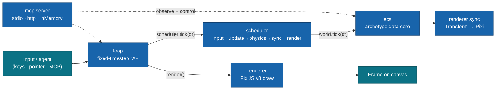

# @nosafesky/ludemic

**An ECS game framework for Moku — Spark-style API and memory layout, PixiJS v8 rendering, with the live runtime exposed to agents over MCP and an additive in-browser editor.**

`@nosafesky/ludemic` is a typed Entity-Component-System runtime you compose into a Moku app: archetype object-SoA component storage, a fixed-timestep loop that bypasses the kernel for the hot path, typed world resources for first-class systems access, and twenty-seven plugins that wire ECS, scheduling, rendering, input, assets, scenes, framework context, an MCP server, native WebAudio audio, versioned save persistence, per-portal publishing, particle/juice VFX, a PixiJS-native UI layer, a shared object-tweening layer, a 2D follow/shake/parallax camera, a **scene-graph hierarchy** and a **2D render-component library** ("the component IS the renderable"), and an **additive Layer-2 in-browser editor subsystem** (single write-authority, field-schema reflection, an enumerable Add-Component catalog, scene serialization, viewport picking with marquee multi-select, a translate/rotate/scale gizmo, undo/redo, an edit/play FSM, and a facade the Layer-3 web editor consumes) together. The runtime is **not** a game engine UI — you drive frames in TypeScript; the editor subsystem is opt-in and a non-editor game pays nothing for it. You define components and systems in TypeScript and drive frames; the framework owns the data layout, the stage order, and the GPU lifecycle.

<br/>

[](#requirements)
[](#requirements)
[](#requirements)
[](./LICENSE)

<br/>

[Why ludemic](#why-ludemic) · [Quick start](#quick-start) · [How it works](#how-it-works) · [Core concepts](#core-concepts) · [Plugins](#plugins) · [Events](#events) · [Scripts](#scripts) · [Requirements](#requirements) · [Docs](#docs) · [License](#license)

---

## Why ludemic

- **Archetype, object-SoA storage.** Entities that share a component signature live in one archetype with parallel columns, so queries iterate cache-coherently — not a `Map<id, object>` scan per frame. A per-component storage seam lets high-churn tags opt into `"sparse"` storage instead.
- **A runtime, not an engine.** The core owns the data model and the frame, not a GUI — you compose plugins into your own Moku app via `createApp` and write systems in TypeScript. Define by negation: it owns the data model and the frame, you own the game.
- **An in-browser editor, opt-in.** A Layer-2 editor subsystem (scene-graph hierarchy, an Add-Component catalog, a 2D render-component library, viewport picking + marquee, a translate/rotate/scale gizmo, undo/redo, and an edit↔play FSM) sits behind a single typed `editor-bridge` seam that a separate Layer-3 web shell consumes. It is **additive and pay-for-what-you-use** — a non-editor game never touches it and pays nothing.
- **The hot path bypasses the kernel.** The fixed-timestep loop drives `scheduler.tick(dt)` → `world.tick(dt)` → `renderer.render()` directly, with no event-bus round-trip per frame. Per-frame work is deliberately *not* emitted as kernel events.
- **Spark-style public API.** `defineComponent`, callable component tokens, typed variadic queries (arities 1–8), a deferred command buffer, and `world.tick(dt)` — the API and memory layout are modeled on [AlexTiTanium/spark](https://github.com/AlexTiTanium/spark).
- **First-class systems access.** A typed world **resource registry** (`defineResource` / `setResource` / `getResource` / `resource` / `hasResource` / `removeResource`) lets systems reach shared singletons through the `world` they already receive — no closure capture. The `context` plugin binds the well-known `Assets` and `GameContext` resources, and `loop` publishes a `Time` clock — all read the same way as any consumer resource. The system signature stays `(world, dt)`.
- **First-class MCP.** A Model Context Protocol server exposes the live runtime to agent clients — query state, step the loop, spawn entities, load scenes, screenshot the frame — without touching game code. The transport is **environment-aware**: `["stdio"]` under Node/Bun, an in-page `["inMemory"]` pair in the browser (no socket), plus optional Streamable HTTP. In-page agents reach the server via `app.mcp.clientTransport()`.
- **Runs headless.** The renderer has a first-class `headless` mode (auto-detected when there is no DOM) that skips Pixi/GPU entirely while still defining `Transform` and running the `sync` system, so the same framework drives a real game in the browser *and* boots cleanly under Bun/Node for tests, simulation, or agent-only hosts.
- **Composable with the Moku family.** Built on `@moku-labs/core`, logs and reads env via `@moku-labs/common`, and mounts its Pixi canvas into a DOM surface from `@moku-labs/web`.

## Quick start

```sh
bun add @nosafesky/ludemic @moku-labs/core @moku-labs/common pixi.js
```

> [!NOTE]
> **Status: `0.x` — early.** Pre-1.0; the public surface may still shift. `@nosafesky/ludemic` (version `0.3.0`) is unpublished — install from the repository ([NoSafeSky/moku-game](https://github.com/NoSafeSky/moku-game)). Consumers use `createApp` from the framework and never import `@moku-labs/core` directly.

```ts
import { createApp } from "@nosafesky/ludemic";
import { Container } from "pixi.js";

// 1. Create the app (synchronous); start() is async and boots the Pixi Application.
const app = createApp({
  pluginConfigs: {
    renderer: { width: 1280, height: 720, background: 0x1099bb, mount: "#game" },
    loop: { fixedDt: 1 / 60 }
  }
});

await app.start();

// 2. Define components on the ECS world (app.ecs IS the World facade).
const Velocity = app.ecs.defineComponent(() => ({ dx: 0, dy: 0 }));

// 3. Define a scene — entities spawned here are owned by the scene.
app.scene.define("level1", {
  setup: (world) => {
    const player = world.spawn(
      app.renderer.Transform({ x: 100, y: 100, rotation: 0, scaleX: 1, scaleY: 1 }),
      Velocity({ dx: 60, dy: 0 })
    );
    app.renderer.attach(player, new Container());
  }
});

// 4. A movement system runs every "update" stage; input is polled, not subscribed.
app.scheduler.addSystem("update", (world, dt) => {
  const input = app.input.snapshot();
  world.query(app.renderer.Transform, Velocity).updateEach(([t, v]) => {
    if (input.isDown("ArrowRight")) t.x += v.dx * dt;
  });
});

await app.scene.load("level1"); // the loop is already driving frames (autoStart: true)
```

## How it works

The `loop` plugin owns the frame. Each fixed step it drives the `scheduler`, which runs every system in canonical stage order against the single ECS `world`; the `renderer` draws once per frame. `mcp` reaches into the same runtime so agents can observe and control it.



## Core concepts

- **The ECS is the data core.** `app.ecs` returns the `World` facade directly — no wrapper. `defineComponent(create, opts?)` registers a component (callable token: `Position({ x, y })` produces a spawn payload); `spawn`, `despawn`, `add`/`remove`/`get`/`set`/`has`, and typed `query(...)` over arities 1–8 are the surface. `Entity` is a generational handle, so stale references are detectably dead via `isAlive`.
- **Stages are the contract.** Systems register into one of five fixed, ordered stages — `input → update → physics → sync → render`. The order is canonical; the `scheduler` validates stage names and forwards to the world.
- **The command buffer is the only mutation path during iteration.** Inside `updateEach` (or any system), structural ops (`spawn`/`despawn`/`add`/`remove`) are deferred and flushed at each stage boundary inside `tick`. This is the path every `mcp` mutating tool uses.
- **World resources are first-class systems access.** The world owns a typed singleton registry — `defineResource(create?)` mints a `Resource<T>` token; `setResource`/`getResource`/`resource`/`hasResource`/`removeResource` read and write it. `resource(token)` asserts presence (throws an actionable error if unset with no factory); `getResource` returns `T | undefined`. Resource ops are **immediate** — they bypass the command buffer even mid-iteration, and aren't counted by `maxStructuralOpsWarn`. Systems reach shared services through the `world` argument, with no closure over `app`. The framework's well-known resources — `Assets` + `GameContext` (from `context`) and `Time` (from `loop`) — are wired at `app.start()`.
- **The loop is fixed-timestep.** Real time is accumulated and consumed in `fixedDt` slices (clamped by `maxFrameDelta`, capped at `maxStepsPerFrame`) so simulation is frame-rate independent; `step()` advances exactly one deterministic tick + render. Each fixed step the loop updates the `Time` world resource in place (`{ dt, elapsed, frame }`, seconds), readable as `app.loop.time` or `world.resource(Time)`.
- **Three-layer Moku model.** `createCoreConfig` (config + events) → `createCore` (framework + the twenty-seven plugins) → `createApp({ pluginConfigs })` (your app). Consumers use `createApp` / `createPlugin` from `@nosafesky/ludemic` and never import `@moku-labs/core` directly. For **advanced / headless** assembly, the framework also re-exports `createCore` (compose a custom core from a plugin subset) and `createCoreConfig` (build a bespoke Layer-1 config) — escape hatches for tooling, tests, and agent-only hosts; `createApp` stays the default.

## Plugins

The framework is twenty-seven plugins, built and resolved in dependency order: `ecs` → `scheduler` → `renderer` + `input` → `loop` + `assets` → `context` → `scene` → `audio` + `storage` → `platform` → `vfx` → `ui` → `tween` → `camera` → `mcp` → **the editor subsystem** (`commands` + `reflection` → `component-registry` + `hierarchy` → `graphics-2d` → `serialization` + `editor-selection` → `editor-history` + `editor-gizmos` + `editor-runtime` → `editor-bridge`). (`audio` and `storage` are dependency-free; `platform` depends on `audio` + `loop` + `storage`; `vfx` depends on `ecs` + `scheduler` + `renderer`; `ui` depends on `renderer` + `scheduler` + `input`; `tween` depends on `scheduler` only; `camera` depends on `renderer` + `scheduler` + `tween` + `input`; `mcp` stays last of the runtime plugins; then the **Layer-2 in-browser editor** — `commands`/`reflection` depend on `ecs` only, `component-registry` is dependency-free, `hierarchy` on `ecs`/`renderer`/`commands`/`reflection`, `graphics-2d` on `ecs`/`renderer`/`reflection`/`component-registry`/`assets`, `serialization` on `ecs`/`storage`/`commands`/`reflection`, `editor-selection` on `ecs`/`renderer`/`camera`/`input`, `editor-gizmos` on `renderer`/`camera`/`editor-selection`/`commands`, `editor-history` on `commands`, `editor-runtime` on `loop`/`scheduler`/`serialization`/`commands`/`tween`/`vfx`/`camera`, and `editor-bridge` last (its eleven dependency edges — every editor seam it aggregates + `mcp` — all point backwards).)

The editor subsystem is **additive and pay-for-what-you-use**: a non-editor game never touches these plugins and pays nothing — `editor-runtime` does not gate the scheduler until an editor shell calls `enterEdit()`, so gameplay runs all stages by default. Two of the newcomers are dual-use runtime capabilities: `hierarchy` (the scene-graph `Node` component + world-transform sync) and `graphics-2d` (the `SpriteRenderer` + `Shape` render components) are useful in any game, not just the editor. The Layer-3 `@moku-labs/web` (Preact) editor **app** that consumes `app["editor-bridge"]` is a separate `createApp` (built alongside this framework under `editor/`).

| Plugin | Tier | Responsibility | Key API |
|---|---|---|---|
| [ecs](src/plugins/ecs/README.md) | Complex | Generational entities, archetype object-SoA storage, typed queries, deferred command buffer, world resource registry, read-only introspection facet, `world.tick`. | `app.ecs.defineComponent` · `spawn` · `query(...).updateEach` · `addSystem` · `defineResource` · `resource` · `componentByName` · `tick` |
| [scheduler](src/plugins/scheduler/README.md) | Standard | The ordered stage contract; thin facade forwarding to the ECS world. | `app.scheduler.addSystem(stage, fn)` · `tick(dt)` · `stages` |
| [renderer](src/plugins/renderer/README.md) | Complex | PixiJS v8 backend — owns the GPU `Application`, defines `Transform`, syncs ECS → display objects, attaches plain-data primitives + textured sprites. Injected texture + world-transform resolver seams (assets/hierarchy), per-view visibility, an editor grid overlay. First-class `headless` mode (no Pixi/GPU). | `app.renderer.Transform` · `attach` · `attachPrimitive` · `attachSprite` · `setTextureResolver` · `setWorldTransformResolver` · `setEntityVisible` · `setGridVisible` · `render` · `screenshot` · `tree` |
| [input](src/plugins/input/README.md) | Standard | Polled keyboard/pointer/**wheel** captured from DOM, frozen into a per-frame snapshot; programmatic key injection with alias normalization. | `app.input.snapshot()` → `isDown` · `justPressed` · `pointer` · `wheel`; `keyDown` · `keyUp` · `keyPress` |
| [loop](src/plugins/loop/README.md) | Standard | Fixed-timestep rAF loop driving `scheduler.tick` then `renderer.render` each frame; publishes the `Time` world resource. | `app.loop.start` · `stop` · `step` (→ `TimeStepResult`) · `isRunning` · `time` |
| [assets](src/plugins/assets/README.md) | Standard | Thin wrapper over Pixi v8 `Assets` — load/cache textures + bundles by alias, build sprites. | `app.assets.load` · `loadBundle` · `sprite` · `get` · `isLoaded` |
| [context](src/plugins/context/README.md) | Standard | Binds the well-known `Assets` + `GameContext` world resources so systems reach them via `world.resource(token)`. | `app.context` → `assets` · `game` |
| [scene](src/plugins/scene/README.md) | Standard | Named scene lifecycle with entity-ownership tracking, clean transitions, bundle pre-load. | `app.scene.define` · `load` · `unload` · `currentScene` · `sceneNames` · `ownedEntities` |
| [mcp](src/plugins/mcp/README.md) | Complex | First-class MCP server exposing the runtime to agents over stdio / Streamable HTTP / in-page `inMemory` (env-aware default); 15 registered tools (4 read-only, the rest mutation/play gated by `enableMutations`). | `app.mcp.isRunning` · `httpEndpoint` · `toolNames` · `clientTransport` |
| [audio](src/plugins/audio/README.md) | Standard | Native WebAudio SFX + music — master **mute bus** (single-call duck for ad breaks), per-channel + master volume, user-gesture `unlock()` (no autoplay), decoded-buffer cache. Zero deps, headless-safe. | `app.audio.unlock` · `load` · `play` · `playMusic` · `stopMusic` · `mute`/`unmute` · `setVolume` · `getVolume` |
| [storage](src/plugins/storage/README.md) | Standard | Namespaced, **versioned** key/value save persistence with a migration chain behind a pluggable `StorageBackend` seam; safe localStorage-or-memory default that **never throws** (in-memory fallback when storage is partitioned/blocked/absent). Zero deps. | `app.storage.get` · `set` · `has` · `remove` · `clear` · `keys` · `isPersistent` · `getVersion` · `setBackend` |
| [platform](src/plugins/platform/README.md) | Complex | Portal-SDK adapter layer (CrazyGames / Poki / Newgrounds / no-op) selected per build via `ctx.env`; promise-based ads that **capture-then-restore-pause** `loop` + mute `audio` (frequency-capped, re-entrancy-guarded); injects a portal-native `StorageBackend` into `storage`; persists + rehydrates `audio` prefs. Zero new deps (SDKs runtime-injected). | `app.platform.getPortal` · `gameplayStart`/`gameplayStop` · `loadingStart`/`loadingFinished` · `commercialBreak` · `rewardedAd` · `isAdPlaying` |
| [vfx](src/plugins/vfx/README.md) | Complex | Game-juice layer — **ECS-native particle emitters** + one-shot bursts (renderer-owned `Graphics` views, fade-by-shrink), **trauma-based screen shake**, Transform **scale-pop**, **floating damage/score text**, and pure **easing** curves. Every effect is a scheduler system over ordinary ECS entities. Emits no events, headless-safe, zero new deps (Pixi via `renderer`). | `app.vfx.createEmitter`/`configureEmitter`/`removeEmitter` · `burst` · `shake`/`stopShake` · `pop` · `floatText` · `easing`/`lerp` |
| [ui](src/plugins/ui/README.md) | Complex | Game-UI layer — a **screen stack** (title / pause / game-over / modal cards), a declarative **widget set** (label / button / panel / bar), a persistent **HUD**, and pointer/touch **hit-testing** — all rendered natively into the renderer's Pixi stage (retained-mode plain-data specs, opaque handles). Emits no events, headless-safe, zero new deps (Pixi via `renderer`). | `app.ui.pushScreen`/`popScreen`/`replaceScreen`/`clearScreens` · `addHud`/`removeHud` · `getWidget`/`setText`/`setValue`/`setVisible` · `getRoot` |
| [tween](src/plugins/tween/README.md) | Standard | Shared, ECS-agnostic **tweening** — animate the numeric props of any plain object (`to`/`from`) or a scalar (`value`) over time with **easing** / **delay** / **repeat** / **yoyo**; opaque `TweenHandle` (`stop`/`pause`/`resume`/`active` + a `done` Promise). One scheduler `"update"` system advances all tweens, so a paused loop freezes them for free (**pause-safe**). Re-exposes the canonical easing table + `lerp`. Emits no events, headless-safe, zero new deps. | `app.tween.to`/`from`/`value` · `killAll` · `count` · `easing`/`lerp` |
| [camera](src/plugins/camera/README.md) | Standard | A **2D game camera** — **follow** (per-frame smoothing), instant + animated **pan / zoom / rotate** (`moveTo`/`zoomTo`/`rotateTo` delegate to `app.tween`), decaying **screen shake**, and **parallax** across world-space **layer containers it owns** (the HUD stays screen-fixed); maps `screenToWorld`/`worldToScreen`. Opt-in **editor controls** (`editorControls`, default off) add instant `focus`/`zoomAt`/`panBy` + an input-driven wheel-zoom/drag-pan system. **Pause-safe** (rides `scheduler.tick`) and **headless-safe**. Emits no events, zero new deps. `reset()` recentres on editor exit-play. | `app.camera.follow` · `setPosition`/`moveTo` · `setZoom`/`zoomTo` · `setRotation`/`rotateTo` · `shake` · `focus`/`zoomAt`/`panBy` · `reset` · `world`/`addLayer`/`layer` · `screenToWorld`/`worldToScreen` |

### Editor subsystem (Layer-2, additive)

An in-browser, Unity-style editor over the live ECS. **Single write-authority**, poll-on-epoch reactivity (no per-frame `emit`), and a two-`createApp` split so the Layer-3 web shell consumes exactly one typed seam. `hierarchy` and `graphics-2d` are dual-use — general runtime capabilities the editor also builds on. Supported by additive **extension deltas** on already-built plugins: `ecs` gains `changeEpoch()` (per-write counter) + `setActiveStages`/`activeStages` (stage gate); `scheduler` forwards them; `assets` gains `entries`/`manifest`/`metadata`; `tween`/`vfx`/`camera` gain `reset()`.

| Plugin | Tier | Responsibility | Key API |
|---|---|---|---|
| [commands](src/plugins/commands/README.md) | Standard | The **single validated write-authority** for editor ECS mutation, and owner of the save-durable branded **`EditorId`**. `apply` returns the inverse; `applyRaw` is the primitive `editor-history` wraps; `restore` is the non-undoable bulk reseed. Structural validation in-plugin + an optional injected rich validator (`setValidator`). Depends on `ecs` only. | `app.commands.apply`/`applyRaw` · `restore` · `resolve`/`editorIdOf` · `setValidator` · `count` |
| [reflection](src/plugins/reflection/README.md) | Standard | **Field-schema registry** for named components — infer a `FieldDescriptor[]` from a live value, or register a typed `field.*` schema (registered wins); pure `validate` used by `commands.setValidator`. Eight field kinds incl. schema-only **`entity-ref`** + **`asset-ref`**. Depends on `ecs` only. | `app.reflection.describe` · `register` · `validate` · `field` (number/boolean/string/color/select/vector2/entityRef/assetRef/readonly) |
| [component-registry](src/plugins/component-registry/README.md) | Standard | An **enumerable Add-Component catalog** — a pure `Map<string, ComponentCatalogEntry>` (name, category, defaults, `addable`) domain plugins register into and the inspector's picker lists. No world access, no config, no deps. | `app["component-registry"].register` · `list` · `byCategory` · `get` · `has` |
| [hierarchy](src/plugins/hierarchy/README.md) | Complex | The **scene-graph** layer — owns one `Node` component (`{ parent, order, name, enabled }`, an ordinary component so serialization stays flat) + a `sync`-stage world-transform system, and injects `renderer.setWorldTransformResolver` so views position in world space. Reparent is a `setField` burst, not a new command kind. Depends on `ecs`/`renderer`/`commands`/`reflection`. | `app.hierarchy.Node` · `worldOf` · `parentOf`/`childrenOf`/`roots` · `depth` · `canReparent` · `computeLocalForPreserveWorld` · `orderBetween` |
| [graphics-2d](src/plugins/graphics-2d/README.md) | Standard | The **2D render-component library** — defines `SpriteRenderer` + `Shape` components ("the component IS the renderable"), a `changeEpoch`-gated `sync` system reconciling them into Pixi views via the renderer's public API, and an injected assets→renderer texture resolver. Registers its catalog entries + reflection schemas. Depends on `ecs`/`renderer`/`reflection`/`component-registry`/`assets`. | `app["graphics-2d"].SpriteRenderer` · `Shape` |
| [serialization](src/plugins/serialization/README.md) | Complex | The **scene (de)serializer** — `serialize`/`deserialize`, `save`/`load` (storage-backed JSON), `list`, `export`/`import`. Keys entities by `EditorId`; the `SceneDocument` stays **FLAT** (the `Node` rides as a plain component); v1→v2 identity migration; validates via `reflection`; routes loads through `commands.restore`. Emits `serialization:loaded`. | `app.serialization.serialize`/`deserialize` · `save`/`load`/`list` · `export`/`import` |
| [editor-selection](src/plugins/editor-selection/README.md) | Standard | **Viewport picking + selection model** — `enable`/`disable` flip Pixi `eventMode` on one camera pick layer; `pickAt` resolves the topmost entity via a non-enumerable stamped handle; modifier-aware `select`/`toggle` (multi-select) and a **drag marquee** (`selectInRect`) that unions world-bounds hits. Emits `editor-selection:changed` only on real change. Headless-safe. | `app["editor-selection"].enable`/`disable` · `select`/`toggle`/`clear` · `selected`/`isSelected` · `pickAt` · `selectInRect` |
| [editor-history](src/plugins/editor-history/README.md) | Standard | The **undo/redo authority** — `applyTracked` wraps `commands.applyRaw` synchronously + records a bounded field-diff inverse; `undo`/`redo` replay via the same funnel; `beginGesture`/`endGesture` coalesce a drag into one entry; ring buffer capped at `maxDepth`; clears on `commands:restored`. Depends on `commands`. | `app["editor-history"].applyTracked` · `undo`/`redo` · `canUndo`/`canRedo` · `beginGesture`/`endGesture` · `clear` |
| [editor-gizmos](src/plugins/editor-gizmos/README.md) | Complex | The **direct-manipulation gizmo** — a Pixi overlay outside the ECS; drag deltas recomputed via `camera.screenToWorld` every event (anti-drift); commits `setField` on pointerup through `commands`, gesture-coalesced via an injected history sink. **translate/rotate/scale/rect** modes (gated behind `translateOnly`, default on) plus `space` (local/global) + `pivot` (pivot/center). Headless-safe. | `app["editor-gizmos"].enable`/`disable` · `setMode`/`mode` · `setSnap` · `setSpace`/`space` · `setPivot`/`pivot` · `setGestureSink` |
| [editor-runtime](src/plugins/editor-runtime/README.md) | Complex | The **edit/play mode FSM** over one world via scheduler stage-gating — `enterEdit` gates gameplay off, `enterPlay` snapshots + un-gates + starts the loop, `stop` restores the snapshot then `reset()`s tween/vfx/camera then re-gates, `step` advances one frame. Emits `editor-runtime:modeChanged`. Does NOT gate at boot (pay-for-what-you-use). | `app["editor-runtime"].enterEdit`/`enterPlay`/`stop`/`step` · `mode`/`isPlaying` |
| [editor-bridge](src/plugins/editor-bridge/README.md) | Complex | The **terminal facade** — one typed surface the Layer-3 web editor consumes. `snapshot()` is an immutable, poll-on-epoch, **hierarchical** view (flat entities carrying `Node`-derived identity + `roots`/`children`) aggregating world/schema/selection/mode/undo. Writes forward through the authority; adds eleven **authoring verbs** (create/createShape/createSprite/delete/duplicate/reparent/reorder/rename/setEnabled/addComponent/removeComponent) as atomic-or-bursted undo steps, plus `listComponents`. At `onStart` it wires `commands.setValidator(reflection.validate)` + the gizmo gesture sink. Registered last. | `app["editor-bridge"].snapshot` · `apply`/`setField` · `create`/`createShape`/`createSprite` · `delete`/`duplicate`/`reparent`/`reorder` · `rename`/`setEnabled` · `addComponent`/`removeComponent`/`listComponents` · `select`/`undo`/`redo` · `play`/`stop`/`step` · `save`/`load`/`describe` |

## Events

The event catalog is intentionally tiny — hot-path frame work (ticks, sync, render, input) is **not** emitted as kernel events. Only coarse milestones cross the bus:

| Event | Payload | When |
|---|---|---|
| `assets:loaded` | `{ alias: string; kind: "asset" \| "bundle" }` | After `app.assets.load()` or `loadBundle()` succeeds (once per call, not per texture). |
| `scene:loaded` | `{ name: string }` | After a scene's `setup` completes during `app.scene.load()`. |
| `game:reset` | `{ reason: "mcp" }` | After the `mcp` `game:reset` tool despawns all MCP-tracked entities and unloads the current scene — listen to re-initialize consumer state. |
| `audio:muteChanged` | `{ muted: boolean }` | After `app.audio.mute()` / `unmute()` / `setMuted()` changes the mute state — a `storage`/`platform` plugin persists it. |
| `audio:volumeChanged` | `{ channel: "master" \| "sfx" \| "music"; value: number }` | After `app.audio.setVolume()` changes a channel volume. |
| `platform:ready` | `{ portal: Portal }` | Once the active portal adapter is initialised and loading is signalled finished. |
| `platform:adStart` | `{ type: "interstitial" \| "rewarded" }` | When an ad begins (after `loop` is paused + `audio` muted) — a HUD can show an "ad playing" overlay. |
| `platform:adEnd` | `{ type: "interstitial" \| "rewarded"; rewarded?: boolean }` | When an ad ends (after `loop` + `audio` are restored). `rewarded` is set for rewarded ads. |
| `commands:restored` | `{ source: "reload" \| "exit-play" }` | After a non-undoable `commands.restore()` reseeds the world + `EditorId` map (scene load / exit-play). `editor-history` listens and clears its stacks. |
| `serialization:loaded` | `{ name: string; entityCount: number }` | After `app.serialization.deserialize()`/`load()` reseeds and the named scene is live. Distinct from the lower-level `commands:restored`. |
| `editor-selection:changed` | `{ selected: readonly Entity[] }` | After the editor selection set actually changes (user-gesture frequency, never per-frame). |
| `editor-runtime:modeChanged` | `{ mode: "edit" \| "play" }` | After an edit↔play mode flip. A HUD / editor shell swaps the Play/Stop button and re-reads live values. |

`assets:loaded` and `scene:loaded` are declared on the framework `Events` (`src/config.ts`); `game:reset` (from `mcp`), `audio:muteChanged` / `audio:volumeChanged` (from `audio`), `platform:ready` / `platform:adStart` / `platform:adEnd` (from `platform`), and the editor milestones `commands:restored` (from `commands`), `serialization:loaded` (from `serialization`), `editor-selection:changed` (from `editor-selection`), and `editor-runtime:modeChanged` (from `editor-runtime`) are plugin-level events declared and emitted by their plugins. Subscribe from a consumer plugin via the `hooks` map (`depends: [assetsPlugin]`, then `hooks: _ctx => ({ "assets:loaded": ({ alias, kind }) => { … } })`). The editor subsystem is otherwise **poll-on-epoch** — panels read `app["editor-bridge"].snapshot()` on their own tick and re-materialize only when `epoch` (mirroring `world.changeEpoch()`) changes; there is no per-frame `emit`.

## Scripts

```sh
bun run build              # Build with tsdown
bun run lint               # Biome check + ESLint
bun run lint:fix           # Auto-fix lint issues (Biome --write + ESLint --fix)
bun run format             # Format with Biome
bun run test               # Run all tests (vitest run)
bun run test:unit          # Unit tests only
bun run test:integration   # Integration tests only
bun run test:coverage      # Tests with coverage
```

## Requirements

- **Node `>= 24`** and **Bun `>= 1.3.14`** — use `bun` exclusively (never npm/yarn/pnpm).
- **TypeScript** in strict mode, with `exactOptionalPropertyTypes` and `noUncheckedIndexedAccess`.
- **[`@moku-labs/core`](https://github.com/moku-labs/core)** — the micro-kernel the three-layer factory chain is built on (consumers go through `createApp`, never import it directly).
- **[`@moku-labs/common`](https://github.com/moku-labs/common)** — provides `ctx.log` (logPlugin) and `ctx.env` (envPlugin) on every plugin context.
- **[`pixi.js`](https://github.com/pixijs/pixijs) `^8`** — the rendering backend the `renderer` and `assets` plugins wrap.
- **Composable with [`@moku-labs/web`](https://github.com/moku-labs/web)** — mount the Pixi canvas into a DOM surface when `renderer.mount` is a selector.
- **`mcp` adds [`@modelcontextprotocol/sdk`](https://github.com/modelcontextprotocol/typescript-sdk), [`hono`](https://hono.dev), and [`zod`](https://zod.dev)** — the MCP server, HTTP transport, and tool input schemas.

## Docs

- Per-plugin references (runtime): [ecs](src/plugins/ecs/README.md) · [scheduler](src/plugins/scheduler/README.md) · [renderer](src/plugins/renderer/README.md) · [input](src/plugins/input/README.md) · [loop](src/plugins/loop/README.md) · [assets](src/plugins/assets/README.md) · [context](src/plugins/context/README.md) · [scene](src/plugins/scene/README.md) · [mcp](src/plugins/mcp/README.md) · [audio](src/plugins/audio/README.md) · [storage](src/plugins/storage/README.md) · [platform](src/plugins/platform/README.md) · [vfx](src/plugins/vfx/README.md) · [ui](src/plugins/ui/README.md) · [tween](src/plugins/tween/README.md) · [camera](src/plugins/camera/README.md)
- Per-plugin references (editor subsystem): [commands](src/plugins/commands/README.md) · [reflection](src/plugins/reflection/README.md) · [component-registry](src/plugins/component-registry/README.md) · [hierarchy](src/plugins/hierarchy/README.md) · [graphics-2d](src/plugins/graphics-2d/README.md) · [serialization](src/plugins/serialization/README.md) · [editor-selection](src/plugins/editor-selection/README.md) · [editor-history](src/plugins/editor-history/README.md) · [editor-gizmos](src/plugins/editor-gizmos/README.md) · [editor-runtime](src/plugins/editor-runtime/README.md) · [editor-bridge](src/plugins/editor-bridge/README.md)
- LLM context: [`llms.txt`](./llms.txt) (concise) · [`llms-full.txt`](./llms-full.txt) (comprehensive reference)

## License

[MIT](./LICENSE) © [moku-labs](https://github.com/moku-labs)
