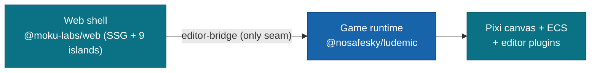

# Moku Editor

**An in-browser, Unity-2D-class visual editor for games built on the Moku ECS framework.**

A Layer-3 `@moku-labs/web` shell that renders a full editor workspace — menu bar, transform toolbar,
nested hierarchy, scene viewport, inspector, asset browser, and status bar — around a live
`@nosafesky/ludemic` runtime. It is a developer tool, not a game and not a content site: two `createApp`
instances share **one** object, the exported `editor-bridge`, and the shell drives the game entirely
through it.

<br/>

[](#requirements)
[](#bundling-notes)
[](#development)
[](https://github.com/moku-labs/web)
[](./LICENSE)

<br/>

[What it is](#what-it-is) · [Quick start](#quick-start) · [Architecture](#architecture) · [The boundary](#the-boundary) · [Development](#development) · [Bundling notes](#bundling-notes) · [Deployment](#deployment)

---

## What it is

The editor renders a docked, four-band workspace around a running game and edits its world visually. Its
look and interaction language are the **"Slate Precision"** design system (a fixed dark-slate, zero-radius,
CAD-grid IDE — see the [design context](../.planning/design/game-editor-ui/design-context.md)):

- **Menu bar** — GameObject / Edit / Window dropdowns (Assets present-but-disabled), a scene readout with
  an amber dirty dot, and open-on-click hover-switch menus.
- **Transform toolbar** — Move / Rotate / Scale / Rect tools, Pivot⇄Center and Local⇄Global segments, the
  Play / Stop / Step transport + mode chip, Undo / Redo, and Save / Load.
- **Hierarchy** — the nested scene tree: expand/collapse, click / ctrl / shift multi-select, drag-reparent
  and reorder, inline rename, an enable-eye toggle, a right-click context menu, and a search filter.
- **Scene view** — a live PixiJS canvas (aspect-correct letterbox) with a selection ring, a CAD grid + snap
  toggle, cursor-anchored zoom in/out/reset with a readout, and Focus.
- **Inspector** — the selection's editable component stack: an object header (enable + rename), collapsible
  component sections with a kebab menu (Reset / Remove Component), eight typed field editors
  (number with drag-scrub / vector / boolean / string / colour / enum / entity-ref / asset-ref), an
  Add-Component picker, a reference-field picker, and a multi-object shared-only view with mixed "—" cells.
- **Asset browser** — a read-only listing of the loaded asset manifest.
- **Status bar** — keyboard-shortcut hint chips + an object / selection / mode readout.

Global **keyboard shortcuts** (W/E/R/T tools, F focus, Ctrl+Z/Y, Ctrl+D, Del, Ctrl+S, Ctrl+A) are a second
surface onto the same actions, suppressed while a text field is focused.

Run on its own, the shell has no host game, so it boots a small **demo scene** (a nested `Neon Drift`
subset — 11 objects across 3 roots) as a stand-in. A real integration replaces that seed with an actual
game (see [`lib/demo-scene.ts`](./src/lib/demo-scene.ts)).

> [!NOTE]
> **Status: 0.x.** The editor consumes the framework's Phase-1 `editor-bridge` surface (a hierarchical
> snapshot + 12 authoring verbs). Saved-layout docking, the console panel, live asset import, and the MCP
> editor mirror are framework follow-ups the shell will consume additively as they land.

## Quick start

> [!IMPORTANT]
> This app consumes the framework `@nosafesky/ludemic` through a `file:..` link, so the framework's
> `dist/` must exist first. From the **repository root**, build the framework once:
> ```sh
> bun install && bun run build
> ```
> On Windows the link is a directory junction; any `bun add`/`bun install` inside `editor/` re-breaks it
> and it must be restored:
> ```powershell
> New-Item -ItemType Junction -Path editor/node_modules/@nosafesky/ludemic -Target <repo-root>
> ```

Then, from `editor/`:

```sh
bun install          # resolves @moku-labs/web + the framework link
bun run dev          # build the shell + serve it at http://localhost:4173
```

`bun run dev` builds the static shell and the client bundle, then serves it. Open
[http://localhost:4173](http://localhost:4173) — the demo scene renders, and every panel is live.

## Architecture

Two frameworks compose in **one browser page** as **two `createApp` instances**. They share exactly one
runtime object — `gameApp["editor-bridge"]` — and nothing else.



- **Web shell** — renders the workspace chrome as static HTML (SSG) and hydrates nine islands; owns routing
  and the client bundle.
- **Game runtime** — owns the Pixi canvas, the ECS world, and all editor plugins. Booted client-side by
  the shell and held as a runtime object in [`lib/editor-host.ts`](./src/lib/editor-host.ts) — the single
  integration seam.
- **The shell polls, it never subscribes.** Moku Core's `App` has no `on`/subscribe member, so
  `editor-host` runs one `requestAnimationFrame` loop over `bridge.snapshot()`; islands gate their heavy
  rebuilds on `snapshot.epoch` and re-read cheap scalars (`selection`/`mode`/`canUndo`/`canRedo`) every
  frame. A committed edit surfaces on the next frame. (Transient view state — gizmo mode, camera zoom/pan,
  grid/snap — takes direct-handle calls off this path, since it is never an undoable world write.)

### Islands

| Island | Drives | Via |
|---|---|---|
| `menu-bar` | GameObject / Edit / Window dropdowns · dirty dot | `bridge.*` (create/duplicate/delete/undo/redo/select) |
| `toolbar` | tools · pivot/space · play/stop/step · undo/redo · save/load | `gizmos.*` (direct) + `bridge.*` |
| `hierarchy` | nested tree · select · reparent/reorder · rename · enable | `bridge.select/reparent/reorder/rename/setEnabled` |
| `viewport` | selection ring · grid/snap · zoom · focus | `onSnapshot` + `camera`/`renderer`/`gizmos` (direct) |
| `inspector` | edit fields · add/remove component · references · multi-object | `bridge.setField/addComponent/removeComponent` |
| `asset-browser` | lists the asset manifest | `assets.entries`/`metadata` |
| `status-bar` | object / selection / mode readout | `onSnapshot` |
| `workspace` | splitter-resizable dock layout (pure view) | — |
| `shortcuts` | global keymap (a second surface onto the above) | `bridge.*` / `gizmos.*` / `camera.*` |

## The boundary

The shell reaches the game **only** through the bridge (plus the viewport/camera/gizmo/asset handles the
bridge intentionally does not forward). It imports no `commands`/`ecs` symbol, no `@moku-labs/core`, and no
`pixi.js` — enforced by [`tests/e2e/bundle-audit.spec.ts`](./tests/e2e/bundle-audit.spec.ts).

| Concern | Allowed surface | Never |
|---|---|---|
| Read world/entities/hierarchy/selection/mode/undo | `bridge.snapshot()` | `ecs.*`, `commands.*` |
| Author content (create/duplicate/delete/reparent/reorder/rename/enable/add-remove component) | `bridge.<verb>` | `commands.apply`, `ecs.set` |
| Edit a field | `bridge.setField` | `ecs.set` |
| Undo / redo · play/stop/step · save/load | `bridge.undo/redo` · `bridge.play/stop/step` · `bridge.save/load` | `editor-history`/`editor-runtime`/`serialization` directly |
| Picking · marquee · rotate/scale/rect gizmos | `editor-selection` / `editor-gizmos` (via editor-host) | `commands`/`ecs` |
| Camera pan/zoom/focus · grid · snap | `camera` / `renderer` / `gizmos` (via editor-host) | `commands`/`ecs` |
| Asset enumeration | `assets.entries/manifest/metadata` | `ecs`, loader internals |

`editor-host` is the one place that touches the game runtime's own APIs (to boot it, mount the canvas, and
re-sync views after a write); `demo-scene` is the one place that authors game content. Both are clearly
fenced — new editor capability is a new authoring verb on the framework's `EditorBridge.Api`, then a new
island, never a reach-through.

> [!NOTE]
> **Build the design, don't port the prototype.** The [design context](../.planning/design/game-editor-ui/design-context.md)'s
> prototype communicates look, feel, behaviour, and the screen/element inventory — nothing more. Every
> panel here is re-implemented from scratch on the real stack (island architecture, `@scope`/`@layer` CSS,
> `data-*` identity — never class selectors, the token system), never copied from the prototype's
> CSS/JS/DOM.

## Development

| Script | What it does |
|---|---|
| `bun run dev` | Build the shell + serve it at `http://localhost:4173` |
| `bun run build` | Build the static shell + repaired client bundle into `dist/` |
| `bun run preview` | Serve an already-built `dist/` at `http://localhost:4173` |
| `bun run test` | Unit + integration tests (vitest) |
| `bun run test:e2e` | Real-browser drives + visual baselines (Playwright) |
| `bun run test:e2e:update` | Regenerate the visual baselines (win32 goldens) |
| `bun run typecheck` | `tsc --noEmit` |
| `bun run lint` | Biome + ESLint |

Tests live in [`tests/unit`](./tests/unit) + [`tests/integration`](./tests/integration) (vitest, happy-dom)
and [`tests/e2e`](./tests/e2e) (Playwright — real-browser drives across all nine panels, a node-free bundle
audit, and per-panel + whole-app visual baselines).

> [!IMPORTANT]
> **Pin Playwright `≥ 1.61`.** On Node ≥ 24 an outdated Playwright (`< 1.60`) deadlocks the runner before
> any test starts (a 0% CPU hang with no output). The config runs the `html` reporter with `open: "never"`
> so a non-CI run never blocks on the auto-opened report, and it is **chromium-only, desktop-only** by
> design — this is a single-window IDE with no mobile layout. Visual goldens are win32-local
> (`*-chromium-win32.png`); regenerate them deliberately with `bun run test:e2e:update`.

## Bundling notes

The client bundle is **node-free** by construction — `mode: "ssg"`, `mcp: { transports: ["inMemory"] }`,
no `@moku-labs/core` — so it ships as static assets. The `tests/e2e/bundle-audit.spec.ts` gate codifies
that (no static `node:*` import, no core, and a source-boundary scan).

Two build details worth knowing (both handled in [`scripts/build.ts`](./scripts/build.ts)):

- **Pixi is bundled from its pre-bundled single-module ESM.** `Bun.build`'s code-splitting mis-links
  Pixi v8's `extensions` singleton (its submodules register with top-level `extensions.add(...)` side
  effects; splitting scatters the declaration from its uses), so a split bundle throws
  `ReferenceError: <id> is not defined` and never boots. The build re-bundles the JS entry as one
  self-contained file, aliasing `pixi.js` to `pixi.js/dist/pixi.mjs` — a single flat module where
  `extensions` lives in one scope. This is a real-browser-only failure, invisible to the happy-dom unit
  tests (Pixi stays headless there), which is why the e2e gate exists.
- **The framework must be built first** (see [Quick start](#quick-start)) — the `file:..` link resolves
  the framework's published `dist/`.

## Deployment

The editor is **local-first**: `bun run dev` boots it against the browser only — scenes persist through
the `storage` plugin (client-side), single user, no server and no account system. That is the intended
workflow today.

When you want a hosted demo, the built `dist/` is static, so any static host works. The repository ships a
**GitHub Pages** workflow ([`.github/workflows/editor.yml`](../.github/workflows/editor.yml)): it validates
every PR (lint · typecheck · coverage · functional e2e + bundle audit) and deploys `editor/dist` on push to
`main`. Since you develop on a feature branch, that deploy stays dormant until you push to `main`.

> [!NOTE]
> Pages *project* sites serve under `https://<owner>.github.io/<repo>/`, but the shell uses root-relative
> asset paths (`/assets/…`). Serve the editor from a user/org **root** Pages site or a custom domain (root)
> so those paths resolve — or set a matching base path in the build. (Cloudflare Pages / Vercel / Netlify
> work equally well for the static `dist/` if you prefer one of those.)

## Requirements

Node ≥ 24 · Bun ≥ 1.3 · Playwright ≥ 1.61 (e2e) · TypeScript strict · [`@nosafesky/ludemic`](../) built
(`bun run build` at the repo root).

## License

[MIT](./LICENSE) © [moku-labs](https://github.com/moku-labs)
